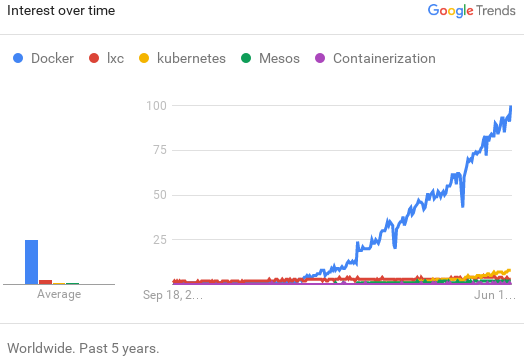
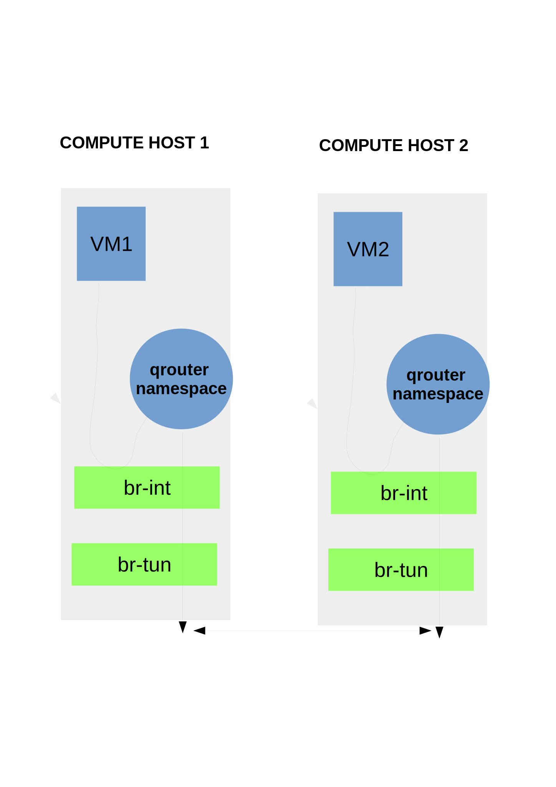

name: title_inversed_whiteText
layout: false
class: center, middle, inverse

##Container Orchestration: Which Conductor?
###ContainerCon Europe, Berlin, Oct 2016
<!-- [.bold.green[Container Orchestration: Swarm, Mesos, Kubernetes - Which Conductor?]] -->
<h3>  &nbsp;&nbsp; &nbsp;&nbsp; &nbsp;&nbsp; Mike Bright,  @mjbright </h3>
<h3>  &nbsp;&nbsp;&nbsp;&nbsp;  &nbsp;&nbsp; Haikel Guemar,  @hguemar </h3>
<h3>  &nbsp;&nbsp; &nbsp;&nbsp; &nbsp;&nbsp; Mario Loriedo,  @mariolet </h3>

???
SpeakerNotes:

TODO: Replace (many) images with "hand drawn" images (via Wacom or Inkscape?)
      Use Jupyter/matplotlib->svg/%%svg for images, graphs, animations ...

TODO: Take tips from this presn: http://asmeurer.github.io/python3-presentation/slides.html#1
      How does this guy do his titles? http://kjbekkelund.github.io/js-architecture-backbone/#2

Abstract
---------
#### .footnote[This presentation on [github](https://github.com/mjbright/LinuxConEU-ContainerOrchestration) on [ContainerCon Schedule](https://linuxconcontainerconeurope2016.sched.org/event/7oHV/container-orchestration-swarm-mesos-kubernetes-which-conductor-mike-bright-hpe)]

Oh my, as if we didn’t have enough container choices with LXC, Docker, rkt, LXD, we still have to choose a container orchestrator and there are lots of them !

Worse - the choice of orchestrator is the new industry battleground.
Feature sets increase rapidly and industry players are making acquisitions and investments.

It’s still early days in container orchestration and so existing solutions partially overlap meaning that combinations of orchestrators may be needed.

So how should you choose for your use case?

In this talk we’ll take a look at what is orchestration and why you need it.
We’ll look at the main contenders amongst Docker Swarm, Google’s Kubernetes, Apache Mesos as well as Fleet, Rancher/cattle and Juju.

We’ll compare and contrast the existing solutions, look at where they are heading and how you can use them in your solution today and tomorrow.

I'm not an expert in this fast moving field, but I hope to give you an overview so you better understand the many tools on offer, so you can differentiate between them.

Everything I tell you may be factual today, but will surely be false in a few months as these fast moving projects vie for position.

---
name: section_history
layout: false
class: center, middle, inverse
## .cyan[First ...]
<!-- .red[ TEST ]  .blue[TEST]  .green[TEST]  .yellow[TEST]  .magenta[TEST]  .cyan[TEST]  .pink[TEST] -->
<!-- .footnote[.green[But lets not forget the alternatives ...]] -->

--
name: section_history
layout: false
class: center, middle, inverse
## A little bit of history

---
layout: false
class: center, middle

So let's first look at what's happened in a very short time.

???
SpeakerNotes:

---
layout: false
class: center, middle
.left-column[
    ## History
]
.right-column[
    ## Containers

]

<!--
     https://www.google.fr/trends/explore?cat=5&q=%2Fm%2F0wkcjgj,lxc,kubernetes,Mesos,%2Fm%2F0db40
-->

<!--
  
-->

???
SpeakerNotes:
talk about
- pre-historique containers (Solaris Zones, BSD Jails, HPUX xxx)
- Linux Containers (LXC) in mainline kernel from 2010
- Then came Docker
  Of course containers existed already, but Docker made them usable
  Of course Docker also did an incredible job marketing their tools
  and inciting developers to adopt and evangelize.

  Docker continue to push boundaries to do complex stuff whilst keeping
  their software simple to use.

  Nevertheless other players wanted more influence and pushed for an open standard.

- OCI was formed in June 2015.
   https://www.opencontainers.org/
   Docker donated libcontainer code        ==> runC
                  base format (+rkt appc?) ==> OCF

- Alternatives: rkt, LXD, Garden/Guardian(?)
      but Docker has the mindshare and continues to make great progress. 
       So although I'm pleased to see alternatives - Open Source alternatives - when I talk about container (engines) I generally consider Docker as a given.

DONE??: image showing "growth" (?) of containers ...
- LXC, Docker, rkt, LXD, runC/OCI, Garden

  

---
layout: false
class: center, middle
.left-column[
    ## History
]
.right-column[
## &mu;-OSes

Several vendors are developing &mu;-OSes, small OS (mainly Linux) to be the basis for container engine hosts
whether they be bare-metal or virtual **host machines**.

These OSes are small, with fast startup, deployment, small attack surface and often *"atomic"* software updates.

- CoreOS          (CoreOS)
- Project Atomic  (RedHat)
- Photon          (VMWare)
- RancherOS       (Rancher)
- Nano Server OS  (Microsoft)
- Ubuntu Snappy Core     (Canonical)
- Nano Server OS  (Microsoft)
]

--
.right-column[
- .bold[.green[...Unikernels (...)]]
]

???
SpeakerNotes:
Describe the raison d'etre of micro-OSes
- Ligthweight OSes - small, including only what's needed
    - SECURITY: small attack surface
- Docker native support (at least), often Kubernetes, ...
    - Support deploying containers across a cluster
- "atomic" updates to OS (CoreOS?): OS is updated as a whole, not package-by-package

Mention HPE ContainerOS for The Machine (HPE Linux)

TODO: http://www.lemagit.fr/conseil/Nano-Server-Microsoft-entre-de-plein-pied-dans-le-monde-des-micro-services

Atomic Host not just kernel+docker:
    Kubernetes, systemd, OpenSSH, Storage: NFS, Gluster, ..., cloud-init, SSSD, Networking (NetworkManager, future: +Open vSwitch), Core dump collection (abrt/systemd-coredump)
    Flannel for networking
RPM+OSTree: Atomic host OS upgrades+rollback

---
layout: false
class: center, middle
.left-column[
    ## History
]
.right-column[
    ## &mu;-Services
]

???
SpeakerNotes:

---
layout: false
class: center, middle
.left-column[
    ## History
]
.right-column[
    ##From monoliths to &mu;-services
]

???
SpeakerNotes:

---
layout: false
class: center, middle
.left-column[
    ## History
]
.right-column[
    ## From monoliths to &mu;-services
Remember when **high availability** meant this ...?

Server nodes running **monolithic applications** in **Active-Standby** modes,
as 1+1, N+1, or N+M

Scaling meant to **"scale up"** by adding CPU, RAM, disk.
But there's a limit to this ... then you have to **scale out**
]

???
SpeakerNotes:

But there's a limit to scaling up ... then you have to manage your application across multiple nodes which means
orchestration, load balancing, monitoring across nodes.

---
layout: false
class: center, middle
.left-column[
    ## History
]
.right-column[
    ## From monoliths to &mu;-services

#### To scale we broke into an N-tier architecture

TODO: schema to demonstrate breaking down of monoliths to N-tier allowing
      flexibility to scale out, possibility of better h/w utilisation

      ==> beakers with different coloured, different size balls ...

]

???
SpeakerNotes:

---
layout: false
class: center, middle
.left-column[
    ## History
]
.right-column[
    ## From monoliths to &mu;-services

#### Then came &mu;-services ..

TODO: schema
      ==> more/smaller beakers/balls ...

Now we can achieve much better hardware utilisation because of the smaller size of components.
]

???
SpeakerNotes:

---
layout: false
class: center, middle
.left-column[
    ## History
]
.right-column[
    ## From monoliths to &mu;-services

But 1000's of nodes are unmanageable ... aren't they?

|   |   |
|---|---|
| We can't take care of our | , |
| so we have to treat them like |  |

that's cloud native !

]

???
SpeakerNotes:

---
name: section_history
layout: false
class: center, middle, inverse
## So we need orchestration

---
layout: false
class: center, middle
.left-column[
    ## Orchestration
]
.right-column[

... we already have many choices for 
**Container Orchestration Engines**

|         | |         |
|:--------|-|:--------|
| Docker Swarm | :  | Docker Inc.      |
| Kubernetes   | :  | Cloud Native Computng Foundation      |
| Apache Mesos | :  | Apache Software Foundation      |
| Fleet        | :  | CoreOS      |
| Cattle | :  | Rancher  |
| Nomad  | :  | HashiCorp |

 
These COEs are to varying degrees  **Imperative** or **Declarative**
]

???
SpeakerNotes:

- Docker : Swarm + Compose (declarative)

- This is the new battleground  (Container Orchestration Wars)
  - We can choose amongst Docker Swarm(*), Kubernetes, Apache Mesos(*), Fleet, Rancher, ...
    - or combinations thereof ...
  - But
    - what do they do?
    - why do we need them
    - is there a winner - do we need a winner ?

---
layout: false
class: center, middle
.left-column[
    ## Orchestration
]
.right-column[
## Imperative or Declarative

   

|                   |         Imperative     |               Declarative      |
| ----------------- | ---------------------- | ------------------------------ |
| **Tell the system**   | what to do             | desired state                  |
|                   | *"start a new node"* | *"3 mysql nodes"* |
| **Intelligence**      | Operator               | Orchestration Engine           |
|                       | ...                    |                                |
| **Flexibility**       | Best                   | Least                          |

]

???
SpeakerNotes:

Container Orchestration Engines can be imperative or declarative

We'll see that Docker Swarm is mostly imperative for now, this has the advantage of being very flexible an operator can request changes precisely as needed.
Docker compose brings a declarative element.

Kubernetes allows to tag all system elements with metadata.
This greatly facilitates declarative requests, e.g. we can say I want 3 Mysql nodes to run **and** they must all have SSDs **and** they must all be in the SW region.
Kubernetes will take care of the rest taking into account available resources as nodes fail/come back on line or apps fail/come back on line.

Apache Mesos is quite imperative, depending upon the scheduler framework used.
Kubernetes can be used as a scheduler enabling declarative scheduling.
It tends to require a set of specialists to manage a cluster.

---
layout: false
class: center, middle
.left-column[
    ## Orchestration
]
.right-column[
# How containers help?

Container solutions such as Docker go beyond the isolation capabilities of LXC by providing simple to use software solutions to enable packaging of apps with their dependencies allowing portable applications between systems.

Containers are lightweight

Containers can be shared

Containers allow to use the same application binaries on development, test and production systems whether that be on a laptop, server or in the cloud.
]

???
SpeakerNotes:

---
name: section_history
layout: false
class: center, middle, inverse
## Choice is great - when you know what you want ...

???
SpeakerNotes:

---
layout: false
.left-column[
    ## Orchestration
   
   
   
]

.right-column[
  ## The Big 3 - Main Orchestration Choices

- Docker Swarm
  - Docker swarm
  - The swarm toolkit
  - Docker "swarm mode"

- Apache Mesos
  - Frameworks
      - Marathon
      - Chronos
  - Plugins
    - Jenkins
  - Minmesos
  - Mesosphere, DC/OS
  
- Kubernetes

.footnote[.green[But lets not forget the alternatives ...]]
]

???
SpeakerNotes:

TODO: Follow Docker logo guidelines here:
    https://www.docker.com/brand-guidelines

TODO: Comparison of Swarm vs. Swarm Toolkit vs. Swarm Mode

TODO: Mesos vs. fwks (Marathon, Chronos, Kubernetes?, Hadoop?) vs. plugins, Jenkins
      Mesosphere and DC/OS, Minimesos, ...

Mesosphere (https://mesosphere.com/) produces Mesosphere Enterprise DC/OS
    Mesosphere Enterprise DC/OS elastically runs containers and data services.
    Proven in production and fully supported, Enterprise DC/OS lets you run modern enterprise apps with confidence.
    YouTube Channel: https://www.youtube.com/channel/UCxwCmgwyM7xtHaRULN6-dxg

Mesos Frameworks:
    http://container-solutions.com/reasons-use-apache-mesos-frameworks/
    http://mesosframeworks.com/: 
        - KAFKA: High throughput publish-subscribe messaging on Mesos 
        - ELK: A fault tolerant, scalable and resilient ELK stack 
        - KIBANA: Explore and visualize your data on Mesos 
        - LOGSTASH: Flexible log aggregation for Mesos 
        - FLOCKER: Seamless software defined storage for Mesos 

    [Rendering Web Crawler for Mesos] http://mesosphere.github.io/presentations/hack-week-2014/#/

    [Mesos] Chronos: https://mesos.github.io/chronos/
        A fault tolerant job scheduler for Mesos which handles dependencies and ISO8601 based schedules
        "Cron for the cloud"

    [Mesosphere] Marathon: https://mesosphere.github.io/marathon/
        A container orchestration platform for Mesos and DCOS

    [Mesosphere] Kubernetes-Mesos: https://github.com/mesosphere/kubernetes-mesos, http://kubernetes.io/docs/getting-started-guides/mesos/
        This repo contains the components required for building the Kubernetes DCOS Service package.
        - Managing DCOS Services - Kubernetes
            - DCOS Overview
            - Kubernetes on Mesos
        - Mesos integration has been fully upstreamed into the Kubernetes repo under contrib/mesos.
            - Getting Started Guide - Mesos
            - Kubernetes on Mesos in Docker
        - For development and testing, Kubernetes on Mesos can be run in Docker on a single host.
            - Getting Started Guide - Mesos/Docker

Mesos+Kubernetes:
    https://platform9.com/blog/compare-kubernetes-vs-mesos/
    https://news.ycombinator.com/item?id=9653650
    http://stackoverflow.com/questions/26705201/whats-the-difference-between-apaches-mesos-and-googles-kubernetes
    [Mesosphere] http://thenewstack.io/mesosphere-now-includes-kubernetes-for-managing-clustered-containers/
        The April 2015 preview of Mesosphere’s Data Center Operating System (DCOS) gives developers
        the means for creating Mesosphere pods around applications, and then launching those applications
        in a large-scale pooled compute and storage environment.

---
.left-column[
  ## Orchestration

  
  

]

.right-column[
## More Choice ...
- Cattle (Rancher),  https://github.com/rancher/cattle
- Fleet (CoreOS), https://github.com/coreos/fleet, A distributed init system (between systemd and etcd)
- Nomad (HashiCorp), https://github.com/hashicorp/nomad

The following are static configuration engines which can be used to automate tasks but they are not orchestration engines as such:
- Ansible
- CloudSlang
- Vagrant
- Juju
]

???
SpeakerNotes:

Cattle: https://github.com/rancher/cattle ==>
    Cattle is the orchestration engine that powers Rancher.
    Its primary role is meta data management and orchestration of external systems.
    Cattle in fact does no real work, but instead delegates to other components (agents) to do the actual work.
    You can look at Cattle as the middle management layer in Rancher.
    Do middle managers really do anything?

Fleet: https://github.com/coreos/fleet ==>
    Fleet ties together systemd and etcd into a simple distributed init system.
    Think of it as an extension of systemd that operates at the cluster level instead of the machine level.

    This project is quite low-level, and is designed as a foundation for higher order orchestration.
    fleet is a cluster-wide elaboration on systemd units, and is not a container manager or orchestration system.
    fleet supports basic scheduling of systemd units across nodes in a cluster.
    Those looking for more complex scheduling requirements or a first-class container orchestration system should check out Kubernetes.
    The fleet and kubernetes comparison table has more information about the two systems.

Nomad: Nomad is a cluster manager, designed for both long lived services and short lived batch processing workloads.
    Developers use a declarative job specification to submit work, and Nomad ensures constraints are satisfied and resource utilization is optimized by efficient task packing.
    Nomad supports all major operating systems and virtualized, containerized, or standalone applications.

    The key features of Nomad are:

    Docker Support: Jobs can specify tasks which are Docker containers.
        Nomad will automatically run the containers on clients which have Docker installed, scale up and down based on the number of instances request, and automatically recover from failures.

    Multi-Datacenter and Multi-Region Aware: Nomad is designed to be a global-scale scheduler.
        Multiple datacenters can be managed as part of a larger region, and jobs can be scheduled across datacenters if requested.
        Multiple regions join together and federate jobs making it easy to run jobs anywhere.

    Operationally Simple: Nomad runs as a single binary that can be either a client or server, and is completely self contained.
        Nomad does not require any external services for storage or coordination.
        This means Nomad combines the features of a resource manager and scheduler in a single system.

    Distributed and Highly-Available: Nomad servers cluster together and perform leader election and state replication to provide high availability in the face of failure.
        The Nomad scheduling engine is optimized for optimistic concurrency allowing all servers to make scheduling decisions to maximize throughput.

    HashiCorp Ecosystem: Nomad integrates with the entire HashiCorp ecosystem of tools.
        Along with all HashiCorp tools, Nomad is designed in the unix philosophy of doing something specific and doing it well.
        Nomad integrates with tools like Packer, Consul, and Terraform to support building artifacts, service discovery, monitoring and capacity management.

    1 million container challenge, https://www.hashicorp.com/c1m.html
        HashiCorp scheduled 1,000,000 Docker containers on 5,000 hosts in under 5 minutes with Nomad, our free and open source cluster scheduler.

    Nomad intro: https://www.nomadproject.io/intro/

- TODO: Add info about
  - Cattle (http://rancher.com/tag/kubernetes/,
          http://rancher.com/tag/cattle/,
          http://rancher.com/5-keys-running-workloads-resiliently-rancher-docker-part-1/,
          http://rancher.com/5-keys-running-workloads-resiliently-rancher-docker-part-2/, 
  - Fleet
  - Nomad

- Juju: https://jujucharms.com/

---
name: section_history
layout: false
class: center, middle, inverse
## Docker Swarm
   

???
SpeakerNotes:

---
layout: false
.left-column[
   
  ## Docker Swarm
  .footnote[.red[] [docker.com](https://docker.com)]
]

.right-column[
  Docker swarm

- Docker engine with Swarm Mode

- Swarm Toolkit

- Swarm

]

???
SpeakerNotes:

---
layout: false
.left-column[
   
  ## Docker Swarm
  .footnote[.red[] [docker.com](https://docker.com)]
]

.right-column[
  ## Docker Swarm Architecture

   
]

???
SpeakerNotes:

TODO: replace image ...

---
layout: false
.left-column[
   
  ## Docker Swarm
  .footnote[.red[] [docker.com](https://docker.com)]
]

.right-column[

## Getting started
Refer to Jerome Pettazoni's wshop on github
]

???
SpeakerNotes:

---
layout: false
.left-column[
   
  ## Apache Mesos
  .footnote[.red[] [mesos.apache.org](http://mesos.apache.org/)]
]

.right-column[
  Apache Mesos

Arguably the most production ready orchestration today, exists since 2009.

Used in production by

- Twitter

- .... ????

Can scale to ~ 10,000 nodes.

Mesos is used in conjunction with Frameworks such as
- Marathon: manages long running tasks
- Chronos: designed for job orchestration
- Hadoop: (YARN?)
- Kubernetes: allowing delcarative use

]

???
SpeakerNotes:

---
layout: false
.left-column[
   
  ## Apache Mesos Architecture
  .footnote[.red[] [mesos.apache.org](http://mesos.apache.org/)]
]

.right-column[
  Apache Mesos Architecture

   

Image courtesy of
http://mesos.apache.org/documentation/latest/architecture/

]

???
SpeakerNotes:

TODO: redo architecture image?

---
layout: false
.left-column[
   
  ## Apache Mesos - Getting started
  .footnote[.red[] [mesos.apache.org](http://mesos.apache.org/)]
]

.right-column[

minimesos?
]

???
SpeakerNotes:

TODO: Add links to more Mesos tutorials, startup systems ...

---
layout: false
.left-column[
   
  ## Kubernetes
  .footnote[.red[] [kubernetes.io](https://kubernetes.io)]
]

.right-column[
Kubernetes is an open source project created by Google based on it's extensive experience running containers
(millions of containers over a decade or so) from it's Borg and Omega projects.

Started ~ Oct 2014, reach v1.0 in in July 2015 and currently at v1.4
It is managed by the Cloud Native Computing Foundation
https://cncf.io/
]

???
SpeakerNotes:

---
layout: false
.left-column[
   
  ## Kubernetes
  .footnote[.red[] [kubernetes.io](https://kubernetes.io)]
]

.right-column[
Kubernetes works with the following concepts:

[**Cluster**](docs/admin/README.md)
: A cluster is a set of physical or virtual machines and other infrastructure resources used by Kubernetes
 to run your applications. Kubernetes can run anywhere! See the [Getting Started Guides](docs/getting-star
ted-guides/) for instructions for a variety of services.

[**Node**](docs/admin/node.md)
: A node is a physical or virtual machine running Kubernetes, onto which pods can be scheduled.

[**Pod**](docs/user-guide/pods.md)
: Pods are a colocated group of application containers with shared volumes. They're the smallest deployabl
e units that can be created, scheduled, and managed with Kubernetes. Pods can be created individually, but
 it's recommended that you use a replication controller even if creating a single pod.

[**Replication controller**](docs/user-guide/replication-controller.md)
: Replication controllers manage the lifecycle of pods. They ensure that a specified number of pods are ru
nning
at any given time, by creating or killing pods as required.

[**Service**](docs/user-guide/services.md)
: Services provide a single, stable name and address for a set of pods.
They act as basic load balancers.

[**Label**](docs/user-guide/labels.md)
: Labels are used to organize and select groups of objects based on key:value pairs.

]

???
SpeakerNotes:

---
layout: false
.left-column[
   
  ## Kubernetes Architecture
  .footnote[.red[] [kubernetes.io](https://kubernetes.io)]
]

.right-column[
  Kubernetes Architecture

- ????

- ????

   

]

???
SpeakerNotes:

TODO: Recreate Kubernetes architecture image

---
layout: false
.left-column[
   
  ## Kubernetes - Getting started
  .footnote[.red[] [kubernetes.io](https://kubernetes.io)]
]

.right-column[
See "HPE Kubernetes" references +?
- minikube?
- ...
]

???
SpeakerNotes:

---
layout: false
.left-column[
   
  ## Kubernetes - Resources
  .footnote[.red[] [kubernetes.io](https://kubernetes.io)]
]

.right-column[
#### Documentation1

Kubernetes documentation is organized into several categories.

  - **Getting started guides**
    - for people who want to create a Kubernetes cluster
      - in [Creating a Kubernetes Cluster](docs/getting-started-guides/README.md)
    - for people who want to port Kubernetes to a new environment
      - in [Getting Started from Scratch](docs/getting-started-guides/scratch.md)
  - **User documentation**
    - for people who want to run programs on an existing Kubernetes cluster
    - in the [Kubernetes User Guide: Managing Applications](docs/user-guide/README.md)
        *Tip: You can also view help documentation out on [http://kubernetes.io/docs/](http://kubernetes.i
o/docs/).*
    - the [Kubectl Command Line Interface](docs/user-guide/kubectl/kubectl.md) is a detailed reference on
      the `kubectl` CLI
    - [User FAQ](https://github.com/kubernetes/kubernetes/wiki/User-FAQ)

]

???
SpeakerNotes:

---
layout: false
.left-column[
   
  ## Kubernetes - Resources
  .footnote[.red[] [kubernetes.io](https://kubernetes.io)]
]

.right-column[
#### Documentation - 2

  - **Cluster administrator documentation**
    - for people who want to create a Kubernetes cluster and administer it
    - in the [Kubernetes Cluster Admin Guide](docs/admin/README.md)
  - **Developer and API documentation**
    - for people who want to write programs that access the Kubernetes API, write plugins
      or extensions, or modify the core Kubernetes code
    - in the [Kubernetes Developer Guide](docs/devel/README.md)
    - see also [notes on the API](docs/api.md)
    - see also the [API object documentation](docs/api-reference/README.md), a
      detailed description of all fields found in the core API objects
  - **Walkthroughs and examples**
    - hands-on introduction and example config files
    - in the [user guide](docs/user-guide/README.md#quick-walkthrough)
    - in the [docs/examples directory](examples/)
  - **Contributions from the Kubernetes community**
    - in the [docs/contrib directory](contrib/)
]
???
SpeakerNotes:

---
layout: false
.left-column[
   
  ## Kubernetes - Resources
  .footnote[.red[] [kubernetes.io](https://kubernetes.io)]
]

.right-column[
#### Documentation - 3

  - **Design documentation and design proposals**
    - for people who want to understand the design of Kubernetes, and feature proposals
    - design docs in the [Kubernetes Design Overview](docs/design/README.md) and the [docs/design director
y](docs/design/)
    - proposals in the [docs/proposals directory](docs/proposals/)
  - **Wiki/FAQ**
    - in the [wiki](https://github.com/kubernetes/kubernetes/wiki)
    - troubleshooting information in the [troubleshooting guide](docs/troubleshooting.md)

#### Community, discussion, contribution, and support

See which companies are committed to driving quality in Kubernetes on our [community page](http://kubernet
es.io/community/).

Do you want to help "shape the evolution of technologies that are container packaged, dynamically schedule
d and microservices oriented?"

You should consider joining the [Cloud Native Computing Foundation](https://cncf.io/about). For details ab
out who's involved and how Kubernetes plays a role, read [their announcement](https://cncf.io/news/announc
ement/2015/07/new-cloud-native-computing-foundation-drive-alignment-among-container).

]
???
SpeakerNotes:

---
layout: false
.left-column[
  ## Other orchestrators
]

.right-column[
  Other orchestrators

- Fleet

- Rancher

- Nomad

  

]

???
SpeakerNotes:

---
layout: false
.left-column[
  ## Use cases
]

.right-column[
  Use cases

- Stackanetes, Mirantis

- OpenShift

- Deis

- CloudFoundry PaaS (Has it's own runC implementation: Garden/Guardian, orchestration; Diego)

- EBay : Kubernetes + OVS

- CoreOS: Tectonnic (commercial Kubernetes offering)

- OpenStack Magnum Project; Supports Docker Swarm, Apache Mesos and Kubernetes (concurrently) enabling
   Infrastructure and Container Management.

- Twitter: Mesos

]
???
SpeakerNotes:

Note; App container management can scale out to existing nodes, but cannot manage infrastructure resources.
OpenStack as a IaaS, via Ironic project can spin up new BM/VM/"LXD?" nodes to provide new resources.

---
layout: false
.left-column[
  ## Players
]

.right-column[
  Choices made by Industry Players

- RedHat: OpenShift (PaaS), Project Atomic

- CoreOS: CoreOS, GIFFE

- Google: Kubernetes used for GCP

- MS

- VMWare

]

???
SpeakerNotes:

---
layout: false
.left-column[
  ## What's common
]

.right-column[
They are converging on many points

They are tending to add 'declarative specification' capabilities.

It's no longer feasible for an operator to decide on which node to deploy especially when complex constraints exist
- making use of specialized hardware, e.g. SSD best for some operations
- adapting to hardware failures

An operator specifies the "desired state" and the orchestrator does the rest.

]

???
SpeakerNotes:

TODO: hmm, to what extent do they trend to declarative (not either or ...)

---
layout: false
.left-column[
  ## What's different
]

.right-column[

Rancher lightweight

]

???
SpeakerNotes:

---
layout: false
.left-column[
  ## Orchestration Lab
]

.right-column[
  Come along to our lab tomorrow

    - Link to schedule

    - Link to lab
       - Docker Swarm
       - Kubernetes
       - Apache Mesos

    - Link to github repo

or just follow along on github

- Come along to Marios' presn

    - Link to schedule

    - Link to lab

    - Link to github repo

]

???
SpeakerNotes:

---
name: demo-page-1
template: inverse
class: center, middle, 

#### Demo - Apache Mesos

<iframe src="https://localhost:9999/" width="800" height="600" >
  
Server is not running

</iframe>

???
SpeakerNotes:

TODO: replace with links to animated gifs (from tty2gif)

---
name: demo-page-2
template: inverse
class: center, middle, 

#### Demo - Kubernetes

<iframe src="https://localhost:9999/" width="800" height="600" >
  
Server is not running

</iframe>

???
SpeakerNotes:
TODO: replace with links to animated gifs (from tty2gif)

---
name: demo-page-3
template: inverse
class: center, middle, 

#### Demo - Docker Swarm

<iframe src="https://localhost:9999/" width="800" height="600" >
  
Server is not running

</iframe>

???
SpeakerNotes:
TODO: replace with links to animated gifs (from tty2gif)

---
name: resources-page-1
template: inverse
class: center, middle, 
layout: false
.left-column[
  ## Resources
]

.right-column[

##Books

| Publisher | Title | Author |    |
|:-----------|:-------|:--------|----|
| OReilly   | Docker Cookbook   | Seb ...
| OReilly   | Docker ??   | Mouat ...
| OReilly   | [Early Access] Kubernetes   | Kelsey Hightower ...
| Manning   | [MEAP] CoreOS in Action |    |
| Manning   | [MEAP] Kubernetes in Action |    |

]
???
SpeakerNotes:

---
name: resources-page-2
template: inverse
class: center, middle, 
.left-column[
  ## Resources
]

.right-column[

##Articles/Organisms

Cloud Native Computing Foundation - Kubernetes, Prometheus
https://cncf.io/
]

???
SpeakerNotes:

---
name: resources-page-3
template: inverse
class: center, middle, 
.left-column[
  ## Resources
]

.right-column[

##Videos

##Repos
]

???
SpeakerNotes:

---
name: last-page
template: inverse
class: center, middle, 

## Questions?

## Thank you
<h3>  &nbsp;&nbsp; &nbsp;&nbsp; &nbsp;&nbsp; Mike Bright, @mjbright </h3>
<h3>  &nbsp;&nbsp;&nbsp;&nbsp;  &nbsp;&nbsp; Haikel Guemar, @hguemar </h3>
<h3>  &nbsp;&nbsp; &nbsp;&nbsp; &nbsp;&nbsp; Mario Loriedo, @mariolet </h3>

